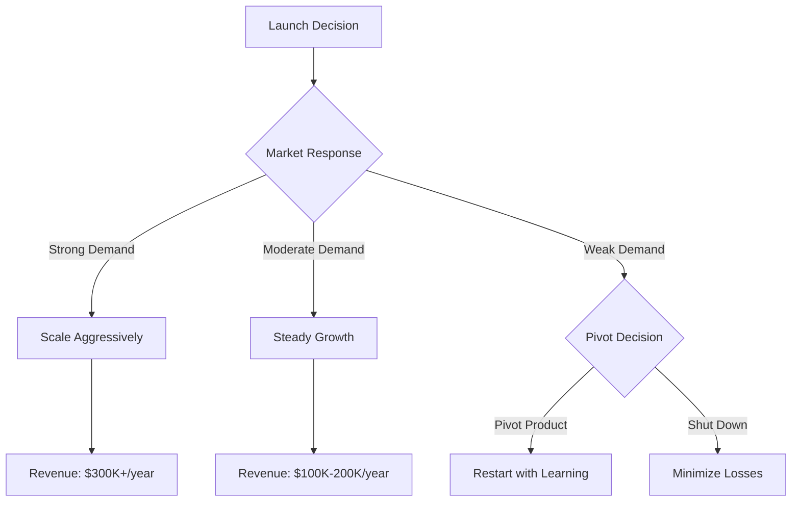
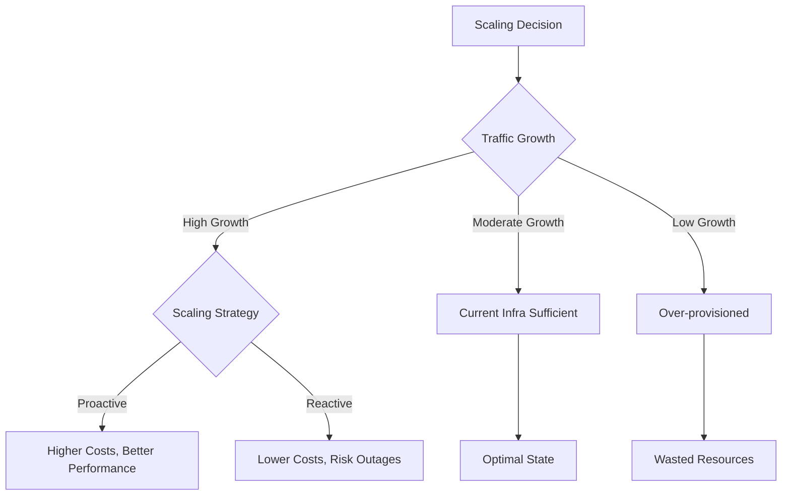

# Scenario Simulation Skill - Example Usage

## Example 1: SaaS Product Launch Decision

### Scenario Overview
A startup is deciding whether to launch a SaaS product. They want to model different scenarios to understand potential outcomes.

### Input Variables

| Variable | Best Case | Expected Case | Worst Case |
|----------|-----------|---------------|------------|
| Monthly Sign-ups | 500 | 200 | 50 |
| Conversion Rate | 15% | 8% | 3% |
| Monthly Price | $99 | $79 | $49 |
| Churn Rate | 3% | 7% | 15% |
| Monthly Operating Costs | $15,000 | $20,000 | $30,000 |

### Decision Tree



### Simulation Code

```python
import pandas as pd
import numpy as np

class SaaSSimulator:
    def __init__(self, monthly_signups, conversion_rate, price, churn_rate, monthly_costs):
        self.monthly_signups = monthly_signups
        self.conversion_rate = conversion_rate
        self.price = price
        self.churn_rate = churn_rate
        self.monthly_costs = monthly_costs

    def simulate_12_months(self):
        customers = 0
        results = []

        for month in range(1, 13):
            # New paying customers
            new_customers = self.monthly_signups * self.conversion_rate

            # Churned customers
            churned = customers * self.churn_rate

            # Net customer count
            customers = customers + new_customers - churned

            # Revenue and costs
            revenue = customers * self.price
            costs = self.monthly_costs
            profit = revenue - costs

            results.append({
                'month': month,
                'customers': int(customers),
                'revenue': revenue,
                'costs': costs,
                'profit': profit
            })

        return pd.DataFrame(results)

# Run scenarios
scenarios = {
    'Best Case': SaaSSimulator(500, 0.15, 99, 0.03, 15000),
    'Expected Case': SaaSSimulator(200, 0.08, 79, 0.07, 20000),
    'Worst Case': SaaSSimulator(50, 0.03, 49, 0.15, 30000)
}

for scenario_name, simulator in scenarios.items():
    print(f"\n{scenario_name} - Year End Results:")
    df = simulator.simulate_12_months()
    final = df.iloc[-1]
    print(f"  Customers: {final['customers']}")
    print(f"  Monthly Revenue: ${final['revenue']:,.2f}")
    print(f"  Monthly Profit: ${final['profit']:,.2f}")
    print(f"  Annual Profit: ${final['profit'] * 12:,.2f}")
```

### Results Summary

#### Year 1 Projections

| Scenario | End Customers | Monthly Revenue | Monthly Profit | Annual Profit |
|----------|---------------|-----------------|----------------|---------------|
| Best Case | 752 | $74,448 | $59,448 | $713,376 |
| Expected Case | 203 | $16,037 | -$3,963 | -$47,556 |
| Worst Case | 14 | $686 | -$29,314 | -$351,768 |

### Key Insights

1. **High Sensitivity to Conversion Rate**: The difference between 3% and 15% conversion dramatically impacts viability
2. **Churn is Critical**: Even best-case scenario needs low churn to maintain growth
3. **Profitability Timeline**: Expected case breaks even around month 18-20
4. **Risk Level**: High - worst case leads to significant losses

### Sensitivity Analysis

Most impactful variables (ranked):
1. Monthly Sign-ups (40% impact on outcome)
2. Conversion Rate (35% impact)
3. Churn Rate (15% impact)
4. Price Point (10% impact)

### Recommendations

1. **Pre-Launch**: Validate conversion rate assumptions with beta testing
2. **Marketing Focus**: Prioritize channels that drive qualified sign-ups
3. **Retention**: Build strong onboarding to minimize churn in first 90 days
4. **Pricing**: Consider $79 as optimal balance between volume and value
5. **Milestones**: Set clear go/no-go metrics at 3-month intervals
6. **Runway**: Ensure 18-24 months of operating capital before launch

---

## Example 2: Infrastructure Scaling Decision

### Scenario Overview
Deciding whether to scale infrastructure proactively or reactively.

### Decision Tree



### Input Variables

| Variable | Best Case | Expected Case | Worst Case |
|----------|-----------|---------------|------------|
| Traffic Growth (monthly) | 5% | 15% | 35% |
| Current Capacity (requests/sec) | 10,000 | 10,000 | 10,000 |
| Scale-up Cost per Tier | $5,000/mo | $5,000/mo | $5,000/mo |
| Outage Cost per Hour | $10,000 | $25,000 | $100,000 |
| Lead Time to Scale (days) | 1 | 3 | 7 |

### Results Summary

#### 6-Month Infrastructure Costs

| Scenario | Total Infra Cost | Outage Risk | Total Risk-Adjusted Cost |
|----------|------------------|-------------|--------------------------|
| Proactive Scaling (Best Case) | $60,000 | Low ($0) | $60,000 |
| Reactive Scaling (Expected) | $35,000 | Medium ($50,000) | $85,000 |
| Under-provisioned (Worst) | $30,000 | High ($400,000) | $430,000 |

### Recommendation

**Choose Proactive Scaling with Auto-scaling**
- Set up monitoring with 70% capacity triggers
- Implement auto-scaling for burst traffic
- Budget for expected case + 20% buffer
- Review monthly and adjust thresholds

---

## How to Use This Skill

1. **Invoke the skill**: Use the skill command in Claude Code
2. **Describe your scenario**: Explain what you want to simulate
3. **Provide variables**: Share the inputs that can change
4. **Review results**: Analyze the simulation output
5. **Iterate**: Refine assumptions and re-run as needed

## Use Cases

- Business planning and forecasting
- Technical capacity planning
- Risk assessment and mitigation
- Investment decisions
- Product launch decisions
- Resource allocation
- A/B test planning
- Pricing strategy
- Hiring and team growth
- Project timeline estimation
